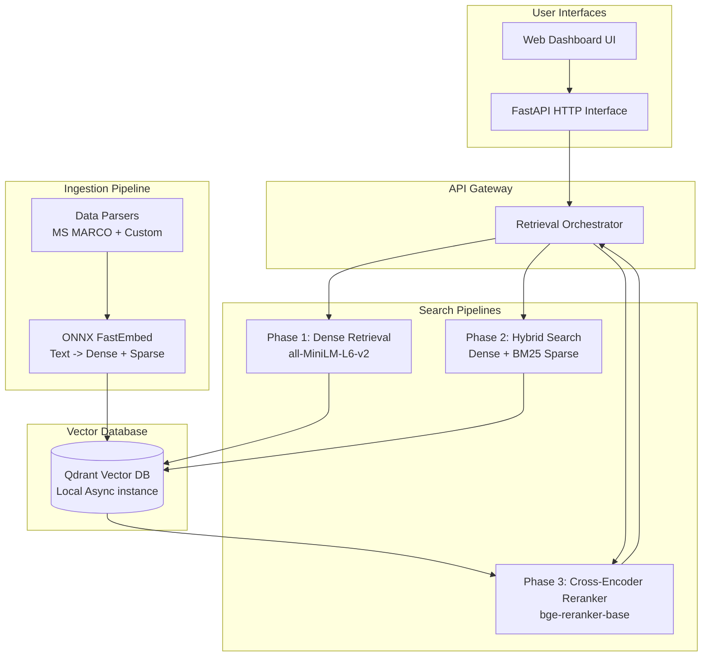

# Architecture

## System Components
1. **Frontend**: Standalone HTML/JS dashboard `index.html` communicating with the backend.
2. **Backend**: FastAPI web server (`app.py`) providing `/search` and `/stats` endpoints.
3. **Retrieval Orchestrator**: Manages dense, sparse, and reranking pipelines. Automatically routes queries.
4. **Vector Store**: Qdrant engine running locally, holding 100k+ passages with dual-vectors (Dense + Sparse) for hybrid search.
5. **Models**: Local ONNX runtimes of `all-MiniLM-L6-v2` (Dense) and `bge-reranker-base` (Cross-encoder).
