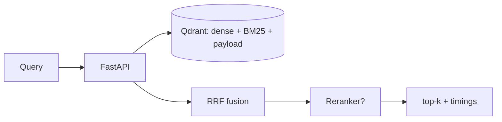

# TrustRAG — Precision-First Vector Retrieval for Enterprise RAG

**ADROSONIC Build, 24-hour hackathon.** Problem: *Vector Database Design for Large-Scale
Precision Retrieval in RAG Systems.*

TrustRAG is an open, measurable retrieval layer: hybrid (dense + BM25) search over MS MARCO
in Qdrant, with metadata filtering applied **inside** the index, live upsert/delete, a
cross-encoder reranker, grounded answers with citations, and a RAGAS + IR evaluation
harness. Everything runs on free-tier tools and consumer hardware.

---

## Quickstart

Install (editable, so `python -m trustrag.cli` resolves):
```bash
pip install -r requirements.txt
pip install -e .
```

### Path A — smoke test, no Docker (fastest sanity check)
```bash
python scripts/offline_check.py       # pure-logic tests, zero ML dependencies
python scripts/make_small_demo.py     # 5-passage in-memory hybrid demo (downloads BGE-small)
```

### Path B — the real 100k+ run (requires Docker)
```bash
docker compose up -d                  # Qdrant on :6333
python -m trustrag.cli build-evalset  # commit data/eval/eval_queries.jsonl (seed 42)
python -m trustrag.cli ingest --n 100000
python -m trustrag.cli serve-api      # FastAPI on :8000
python -m trustrag.cli serve-ui       # Streamlit on :8501
```

### Path C — restore a published snapshot (evaluators, minutes not hours)
```bash
docker compose up -d
python -m trustrag.cli snapshot create   # on the build machine
# publish the snapshot URL (free GitHub release / HF dataset), then on the eval machine:
python -m trustrag.cli snapshot restore
```

---

## Commands

```bash
python -m trustrag.cli up                 # docker compose up -d
python -m trustrag.cli build-evalset      # build the committed eval set
python -m trustrag.cli ingest --n 100000  # index MS MARCO (resumable, idempotent)
python -m trustrag.cli eval --mode hybrid --split test --judge non-llm
python -m trustrag.cli bench --mode hybrid --n 100 --no-cache
python -m trustrag.cli report             # generate docs/BENCHMARK_REPORT.md from results/
python -m trustrag.cli serve-api          # FastAPI on :8000
python -m trustrag.cli serve-ui           # Streamlit on :8501
```

API endpoints: `POST /search`, `POST /answer`, `PUT /documents/{id}`, `DELETE /documents/{id}`,
`POST /documents/upload`, `GET /health`, `GET /config`, `GET /metrics`, `GET /eval/results`.
Full OpenAPI at `http://localhost:8000/docs`.

---

## Architecture

Ports and adapters: `src/trustrag/core/` defines interfaces (no vendor SDK); `adapters/`
implements Qdrant, sentence-transformers, BM25 and Groq. Hybrid = dense + BM25 prefetch
(each with the **same filter inside**), fused by RRF/weighted/DBSF, optionally reranked.
See [`docs/architecture.md`](docs/architecture.md) and the 12 ADRs in [`docs/adr/`](docs/adr/).



## Evaluation & honesty

- **Seed-42 eval set**, dev (200) for tuning, test (400) for reported numbers.
- **Three metric families**: LLM-judged RAGAS, non-LLM RAGAS, classical IR (Hit@5, P@5, R@5, MRR@10, nDCG@10).
- Every number traces to a committed file in `results/`. No fabricated metrics.
- If a threshold is missed, the actual number is reported with analysis — never moved.

## Free tier only

No paid key is required. `GROQ_API_KEY` is optional (copy `.env.example` to `.env`);
without it, answers fall back to extractive mode and evaluation uses non-LLM metrics.

## Testing

```bash
python scripts/offline_check.py   # pure-logic smoke test, no dependencies
pip install pytest && pytest -q   # full unit suite (needs deps installed)
```

## Limitations (stated plainly)

- Benchmark is MS MARCO (short web passages); enterprise documents are longer and structured.
- `category` inherits MS MARCO's native `query_type`; `topic`/`acl_groups` are derived/synthetic and flagged in the data.
- Hallucination is **reduced and measured**, not eliminated.

See the full spec in [`docs/PRD.md`](docs/PRD.md), business framing in
[`docs/BUSINESS_CASE.md`](docs/BUSINESS_CASE.md), and the demo/pitch plan in
[`docs/DEMO.md`](docs/DEMO.md).

## Banking Vertical: Intent Router
TrustRAG includes a domain-aware routing layer configured via `configs/banking_taxonomy.yaml`. It evaluates incoming banking queries (e.g. "KYC documents") and applies highly efficient pre-retrieval Qdrant payload filters to restrict the search space, avoiding cross-domain semantic hallucination. See `REPORT.md` and `docs/adr/ADR-009-lexical-routing.md` for architecture and latency evaluation.
