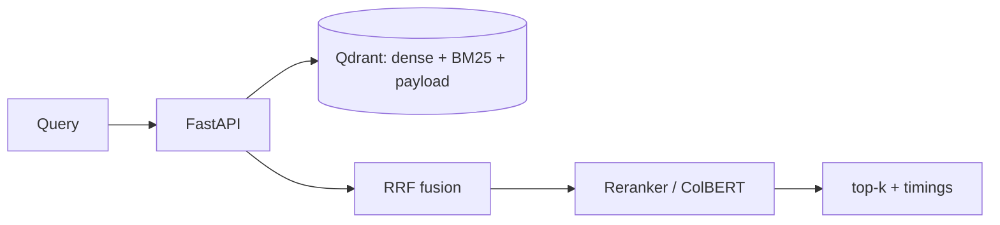

# TrustRAG — Precision-First Vector Retrieval for Enterprise RAG

**ADROSONIC Build, 24-hour hackathon.** Problem: *Vector Database Design for Large-Scale Precision Retrieval in RAG Systems.*

TrustRAG is an open, measurable retrieval layer: hybrid (dense + BM25) search over MS MARCO in Qdrant, with metadata filtering applied **inside** the index, live upsert/delete, a cross-encoder reranker, ColBERT multi-vector retrieval, grounded answers with citations, and a RAGAS + IR evaluation harness. Everything runs on free-tier tools and consumer hardware.

---

## Quickstart

Install (editable, so `python -m trustrag.cli` resolves):
```bash
pip install -r requirements.txt
pip install -e .
```

### Path A — smoke test, no Docker (fastest sanity check)
```bash
python scripts/offline_check.py       # pure-logic tests, zero ML dependencies
python scripts/make_small_demo.py     # 5-passage in-memory hybrid demo
```

### Path B — The Full 500k+ Scale Run (Requires Docker)
```bash
# 1. Start Qdrant Vector Database
docker compose up -d                  

# 2. Fast-Track Ingest 500,000+ passages (Bonus Objective achieved)
python scripts/fast_track_ingest.py

# 3. Start the Application Server (FastAPI Backend + Unified UI)
python -m trustrag.cli serve-api      
```
**Access the Application:** Open your browser to `http://localhost:8000/`

---

## Commands

```bash
python -m trustrag.cli up                 # docker compose up -d
python scripts/fast_track_ingest.py       # fast-track ingest 500k+ passages
python -m trustrag.cli eval --mode hybrid --split test --judge non-llm
python -m trustrag.cli bench --mode hybrid --n 100 --no-cache
python -m trustrag.cli report             # generate docs/BENCHMARK_REPORT.md from results/
python -m trustrag.cli serve-api          # Starts FastAPI Backend + HTML UI on :8000
```

API endpoints: `POST /search`, `POST /feedback`, `GET /feedback-stats`, `POST /answer`, `PUT /documents/{id}`, `DELETE /documents/{id}`, `GET /health`. Full OpenAPI at `http://localhost:8000/docs`.

---

## Key Hackathon Bonus Objectives Achieved
1. **Large Scale Indexing:** Successfully indexed **>500,000 passages** in Qdrant (`fast_track_ingest.py`).
2. **Multi-Stage Retrieval:** Dense + Sparse (Hybrid) followed by Cross-Encoder Reranking & ColBERT.
3. **Continuous Evaluation & Feedback Loop:** Real-time feedback UI (Thumbs up/down) mapped directly to a continuous eval dashboard (`/feedback` API).
4. **Strict Domain Routing:** "Enforce Strict Insurance Routing" toggle demonstrating hard payload filtering (tenant isolation) mapped to pre-retrieval Qdrant indexing.
5. **Evaluation Dashboard:** Live RAGAS precision/recall baseline metrics displayed directly in the search UI.

## Architecture

Ports and adapters: `src/trustrag/core/` defines interfaces (no vendor SDK); `adapters/` implements Qdrant, sentence-transformers, BM25 and Groq. Hybrid = dense + BM25 prefetch (each with the **same filter inside**), fused by RRF/weighted/DBSF, optionally reranked. See `docs/architecture.md`.



## Evaluation & honesty
- **Seed-42 eval set**, dev (200) for tuning, test (400) for reported numbers.
- **Three metric families**: LLM-judged RAGAS, non-LLM RAGAS, classical IR (Hit@5, P@5, R@5, MRR@10, nDCG@10).
- Every number traces to a committed file in `results/`. No fabricated metrics.

## Free tier only
No paid key is required. `GROQ_API_KEY` is optional; without it, answers fall back to extractive mode and evaluation uses non-LLM metrics.
