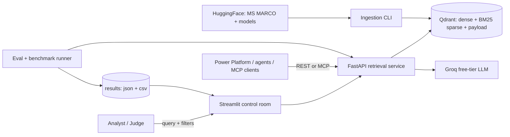
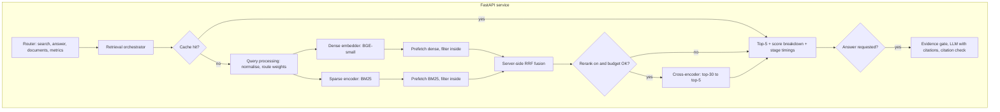
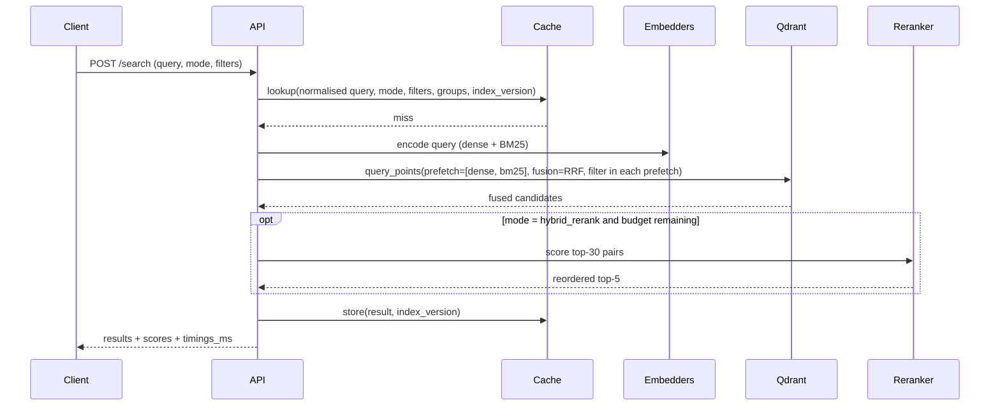
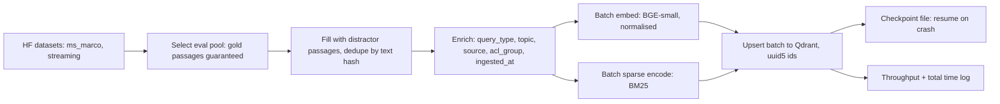

# PRD — TrustRAG: Precision-First Vector Retrieval for Enterprise RAG

**Working title:** TrustRAG (rename freely)
**Event:** ADROSONIC Build, 24-hour Hackathon, BIT Mesra (2–4 Oct 2026)
**Problem statement:** Vector Database Design for Large-Scale Precision Retrieval in RAG Systems
**Version:** 1.0 (planning baseline)

> **Read this first.** Every number in this PRD is a *target* or a *planning estimate*, never a result. Results exist only as logged runs in `results/` (see §8). Nothing in the demo, report or pitch may quote a number that does not trace back to a file in `results/`.

---

## 0. How to use this document

| You are… | Read |
|---|---|
| A teammate | §1–§4 (what and why), §13 (who does what, when) |
| Antigravity / any coding agent | Everything. §5–§10 are the build spec. §14 is the definition of done. |
| Preparing the pitch | §2, §11, §12, then `03_BUSINESS_CASE.md` and `04_DEMO_AND_PITCH_PLAYBOOK.md` |

Priority tags used throughout: **P0** = gate (must ship, or we lose eligibility or core points), **P1** = differentiator (cheap, high judge value), **P2** = stretch (only after P0 and P1 are demonstrably done).

---

## 1. Executive summary

**Vision.** A retrieval layer an enterprise can trust: measurably more precise than naive RAG, fast enough for a live workflow, controllable enough for governance, and cheap enough to run on a laptop with free-tier tools.

**What we build.**
1. An ingestion pipeline that indexes 100,000+ MS MARCO passages (stretch: 500,000+) into **Qdrant** with dense vectors, BM25 sparse vectors and filterable metadata, in under 2 hours on CPU.
2. A **FastAPI retrieval service** with four selectable modes (dense, hybrid, hybrid+rerank, and sparse for ablation), stage-level timing on every response, live upsert/delete, and optional grounded answers with citations and abstention.
3. A **Streamlit control room**: live query with dense/hybrid toggle, per-passage score breakdown, metadata filters, RAGAS dashboard, latency benchmark, and a live-update panel.
4. An **evaluation harness** that produces Phase 1 vs Phase 2 RAGAS scores plus classical IR metrics from a fixed, versioned eval set, and a 100-query latency benchmark.
5. A **business case** positioning the retrieval layer as a reusable accelerator for Adrosonic's insurance, banking, retail and non-profit clients.

**What the judges should remember.**
- *Measured:* an ablation ladder (dense → hybrid → hybrid+rerank) with logged metrics, not adjectives.
- *Engineered:* ports-and-adapters architecture, stage-timed pipeline, latency-budgeted degradation, idempotent ingestion, one-command reproducibility.
- *Valuable:* trust features (pre-filtering, permission-aware retrieval, citations, abstention, live updates) tied to a credible deployment story.

---

## 2. Winning strategy

### 2.1 The official scorecard (from the problem statement, §06)

| Criterion | Weight | What we do about it |
|---|---|---|
| Retrieval quality improvement | 30% | Ablation ladder; held-out test split; both RAGAS metric families; tuned on a separate dev split. |
| System performance (p95 < 300 ms, 100 consecutive queries) | 20% | Stage timers; benchmark runner hits the real HTTP API; cache OFF for the official number; idle machine. |
| Architecture quality | 20% | Hexagonal design, ADRs, C4-style diagrams, tests, config-driven behaviour. |
| Hybrid search implementation | 20% | BM25 as Qdrant sparse vectors + dense, RRF with configurable `k` and weights, documented and ablated. |
| Demo and presentation | 10% | Run-of-show mapped 1:1 to the judges' 7-step checklist. |

### 2.2 The three axes you told me matter most

You said the solution will mainly be judged on **system architecture, add-on features and business evaluation**. These do not appear as separate rows in the PDF scorecard, so I am treating them as *emphasis*, not a replacement. If organisers confirm different weights, re-order §11 accordingly.

| Axis | Our position |
|---|---|
| **System architecture** | Ports-and-adapters core; one store for dense + sparse + payload; server-side fusion; filters inside every prefetch (true pre-retrieval); SLA-aware pipeline; versioned cache invalidation; snapshot-based reproducibility; observability endpoint; 12 written ADRs. |
| **Add-on features** | Cross-encoder reranker, grounded answers with citations and abstention, semantic cache, explainable scores, live eval dashboard, permission-aware retrieval, bring-your-own-documents, MCP tool server (stretch). All map to the PDF's own bonus list or to the enterprise-trust story. |
| **Business evaluation** | Vertical positioning on Adrosonic's own industries, vendor-neutral architecture (swap the store behind a port), unit-economics worksheet from first principles, open-core packaging, GTM through Adrosonic delivery. See `03_BUSINESS_CASE.md`. |

### 2.3 Gates — lose these and nothing else matters

| ID | Gate | How we satisfy it |
|---|---|---|
| C-01 | Free-tier only; paid keys = disqualification | Qdrant (Docker, local), HuggingFace models (local), Groq free tier only. **No paid key is ever required to run the repo.** |
| C-02 | Phase 1 and Phase 2 RAGAS logged and in the report | `results/ragas_*.json` + generated report. |
| C-03 | Hybrid in Phase 2 | Dense + BM25 sparse + RRF. |
| C-04 | ≥ 100,000 MS MARCO passages | Ingest log with count verified via Qdrant `count`. |
| C-05 | 100 consecutive queries, p95 logged, no self-reported estimates | `results/latency_*.csv` produced by the benchmark runner. |
| C-06 | GitHub repo, clone-and-run | Clean-clone test in P8; README; snapshot restore. |
| C-07 | Phase 1 baseline logged first | Tag `phase1-baseline` before any Phase 2 code lands. |

> **A note on "any software, any limits."** Going wide is fine; going *paid* is not. Anything requiring a paid key can disqualify the whole submission (C-01). The plan below uses only free components and still reaches every bonus item.

---

## 3. Users, use cases, verticals

**Personas**
- **Claims / policy analyst (insurance):** asks natural-language questions over policy wordings and SOPs; a plausible-but-wrong passage becomes a wrong decision.
- **Compliance officer (banking & finance):** needs answers scoped to the documents they are *permitted* to see, with citations an auditor can follow.
- **Platform engineer (the buyer's technical owner):** wants an open, swappable, observable retrieval service, not a black box.
- **Hackathon evaluator:** has 10 minutes; needs to see the checklist satisfied and be able to clone and run.

**Core use cases**
- UC-1 Ask a question, get top-5 passages with scores, choose retrieval mode.
- UC-2 Restrict the search (category/source/date/permission) with the restriction applied inside the vector index.
- UC-3 Add, update or delete a passage and see the effect immediately, without reindexing.
- UC-4 Get a grounded answer with citations, or an honest "insufficient evidence".
- UC-5 Inspect *why* a passage ranked where it did (dense rank, BM25 rank, fusion, rerank).
- UC-6 Check quality and speed on demand (RAGAS dashboard, latency benchmark).

**Vertical fit (taken from Adrosonic's public site):** Insurance, Banking and Finance, E-Commerce and Retail, Non-Profit. Two of the three hackathon problem statements are insurance-themed, so insurance is the primary pitch vertical.

---

## 4. Scope

| Priority | In scope |
|---|---|
| **P0** | FR-1 … FR-6 (PDF), evaluation harness, 100-query benchmark, benchmark report, README, architecture diagram, tagged Phase 1 baseline |
| **P1** | Reranker, explainable scores + stage-timing waterfall, ablation ladder, query cache, grounded answers with abstention, evaluation dashboard, 500k-passage scale run with quantization study, ADR set, STATUS.md checkpoints |
| **P2** | Permission-aware retrieval (ACL groups), bring-your-own-documents upload, MCP server, adaptive fusion router, pgvector adapter, Spline landing page, Power Platform connector notes |
| **Out** | Fine-tuning embedding models, paid APIs, multi-node Qdrant clusters, user auth/SSO, mobile UI |

---

## 5. System architecture

### 5.1 Principles
1. **The API is the product.** UI, benchmark runner, eval harness and MCP server are all clients of the same service.
2. **Ports and adapters.** `core/` defines interfaces (`Embedder`, `SparseEncoder`, `VectorStore`, `Reranker`, `Generator`, `Cache`); `adapters/` implements them. `core/` never imports a vendor SDK. This is also the business story: the store is swappable.
3. **One store, one truth.** Dense vectors, BM25 sparse vectors and payload live on the same Qdrant point, so filters, updates and deletes apply to every retrieval leg consistently.
4. **Config over constants.** Fusion method, `k`, weights, candidate depth, thresholds, model names: all in `configs/*.yaml`, overridable per request, hashed into every result log.
5. **Measure every stage.** Every response carries `timings_ms` per stage.
6. **Fail soft.** Reranker, cache and LLM are optional; each degrades gracefully (skip rerank over budget, bypass cache, extractive fallback if the LLM is rate-limited).
7. **Reproducible by default.** Pinned deps, seeded splits, resumable ingestion, Qdrant snapshot restore.

### 5.2 System context



### 5.3 Query path (components)



### 5.4 Query sequence



### 5.5 Ingestion path



### 5.6 Repository layout

```
trustrag/
├── AGENTS.md                     # rules for the coding agent
├── README.md                     # setup, run, demo, results (NFR-6)
├── Makefile                      # thin wrappers over the CLI
├── docker-compose.yml            # qdrant (+ optional api, ui)
├── pyproject.toml / requirements.txt   # pinned
├── .env.example                  # GROQ_API_KEY=  (never committed with a value)
├── configs/
│   ├── retrieval.yaml            # modes, fusion, k, weights, candidate depth, thresholds
│   ├── models.yaml               # embedder, reranker, LLM names
│   └── eval.yaml                 # seeds, split sizes, judge model, rate limits
├── src/trustrag/
│   ├── core/                     # domain models + ports (no vendor imports)
│   ├── adapters/                 # qdrant_store, st_embedder, bm25_sparse, ce_reranker,
│   │                             #   groq_generator, memory_cache, (pgvector_store: P2)
│   ├── ingestion/                # msmarco_loader, enrich, pipeline (batch+checkpoint), upload (P2)
│   ├── retrieval/                # orchestrator, modes, fusion (rrf/weighted/dbsf), router, filters, explain
│   ├── answering/                # evidence_gate, prompt, citation_check, extractive_fallback
│   ├── evaluation/               # eval_set, ir_metrics, ragas_runner, benchmark, report
│   ├── api/                      # FastAPI app, schemas, deps, metrics
│   ├── ui/                       # Streamlit pages
│   └── cli.py                    # trustrag ingest | eval | bench | report | snapshot
├── tests/                        # unit + integration + prefilter proof + cache invalidation
├── data/eval/                    # eval_queries.jsonl (committed, versioned)
├── results/                      # ragas_*.json, ir_*.json, latency_*.csv (committed)
├── docs/
│   ├── PRD.md  STATUS.md  architecture.md  BENCHMARK_REPORT.md  BUSINESS_CASE.md  DEMO.md
│   ├── adr/ADR-001 … ADR-012
│   └── img/                      # screenshots for the report
└── scripts/                      # snapshot_restore, make_small_demo
```

### 5.7 Technology choices and ADRs

Each row becomes a full ADR in `docs/adr/` (use the `architecture-decision-records` skill, MADR format).

| ADR | Decision | Alternatives considered | Why | Revisit if |
|---|---|---|---|---|
| 001 | **Qdrant** (Docker, local) as the single store | pgvector, ChromaDB, Weaviate | Native dense + sparse on one point, Query API with prefetch and fusion, payload indexes, upsert/delete by ID, quantization, snapshots. All free. | Docker is impossible on the team's machines. |
| 002 | **BM25 as Qdrant sparse vectors** (`Qdrant/bm25` via FastEmbed, `Modifier.IDF`) | external `rank_bm25` / `bm25s` index | IDF is computed server-side against the live corpus, so live upserts/deletes keep BM25 statistics current; filters apply to the sparse leg identically; one round trip. An external in-memory index would break FR-4 and FR-5. | BM25 quality needs custom analyzers the sparse path can't express. |
| 003 | **BAAI/bge-small-en-v1.5** (384-d) via sentence-transformers, query instruction prefix on queries | all-MiniLM-L6-v2, bge-base | Strong quality per CPU-millisecond; satisfies "HuggingFace sentence-transformer" literally; 384-d keeps RAM small. | p95 budget is blown by the encoder, then try MiniLM-L6 or ONNX backend. |
| 004 | **Server-side RRF** by default; client-side fusion (weighted/linear, DBSF, adaptive) for explain mode and ablation | client-side only | Fewest round trips; deterministic; configurable `k` and weights. Client path gives per-leg ranks for explanations. | Server RRF lacks a needed weighting option in the installed client version. |
| 005 | **Filter inside every prefetch** | one filter at the top-level query | A top-level filter can act on the already-fused candidates (post-retrieval). Putting the same filter in each prefetch makes it true pre-retrieval (FR-4). Proven by a selective-filter test (§8.6). | — |
| 006 | **Cross-encoder rerank** (`cross-encoder/ms-marco-MiniLM-L-6-v2`) behind a latency budget | no rerank, bge-reranker-base | Trained on MS MARCO, so strong fit; budget guard skips or shrinks rerank to protect p95. | Rerank p95 alone exceeds budget even at 20 candidates. |
| 007 | **FastAPI service + Streamlit UI** | Streamlit-only, Next.js | The API is reusable (benchmark, MCP, Power Platform); Streamlit is the fastest path to a complete demo. | Time remains after P1 and a richer UI adds judge value. |
| 008 | **Ports and adapters** | direct SDK calls | Swappable store/models; unit tests with in-memory fakes; business story of vendor neutrality. | — |
| 009 | **Dev/test split; dual metric families** (LLM-judged RAGAS + non-LLM RAGAS + IR metrics) | single RAGAS run | Prevents tuning on the test set; non-LLM metrics are free and rate-limit-proof; IR metrics use gold labels. | — |
| 010 | **Deterministic UUIDv5 point IDs**, original `passage_id` in payload | raw string IDs | Qdrant point IDs must be unsigned integers or UUIDs; deterministic IDs make upsert idempotent and ingestion resumable. | — |
| 011 | **Cache keyed on query + mode + filters + groups + `index_version`**; version bumps on every upsert/delete | TTL only | Prevents stale or leaked results after live updates. | — |
| 012 | **Groq free tier** for generation and LLM-judged RAGAS, with extractive fallback and backoff | local LLM | Free, fast; fallback keeps the demo alive when limits hit. Verify the current free model list at build time. | Groq limits make judged RAGAS impractical, then lean on non-LLM metrics and a smaller judged sample. |

### 5.8 Data model

**Collection `passages`**

| Field | Type | Notes |
|---|---|---|
| point id | UUIDv5(passage_id) | ADR-010 |
| vector `dense` | float32 × 384, cosine | BGE-small; normalised |
| sparse vector `bm25` | sparse, `modifier = IDF` | FastEmbed `Qdrant/bm25`; term-frequency values only, Qdrant applies IDF |
| payload `passage_id` | string | e.g. `msmarco-train-12345-3` |
| payload `text` | string | passage text |
| payload `source` | keyword | `msmarco`, or file name for uploads |
| payload `category` | keyword | native MS MARCO `query_type` ∈ {NUMERIC, DESCRIPTION, ENTITY, LOCATION, PERSON}; `user_upload` for uploads |
| payload `topic` | keyword | derived by k-means over embeddings (≈12 clusters), labelled by top terms. **Derived label.** |
| payload `acl_groups` | keyword[] | **Synthetic** demo labels, deterministic hash of passage id (P2) |
| payload `doc_version` | integer | bumped on update |
| payload `ingested_at` | datetime | enables date-range filter |
| payload `label_origin` | keyword | `native` / `derived` / `synthetic`, so the demo is honest about it |

**Payload indexes:** `category`, `source`, `topic`, `acl_groups` (keyword); `ingested_at` (datetime); `doc_version` (integer).

> **Demo honesty note.** A passage inherits `query_type` from the query it was paired with in MS MARCO, so filtering by it correlates with the answer type. In an enterprise deployment the tag would come from the source system (department, product line, document type, date). Say this out loud in the demo; judges respect it.

### 5.9 Corpus construction (guarantees gold passages exist)

1. Stream MS MARCO from HuggingFace (`microsoft/ms_marco`; the agent verifies the available configs and splits at runtime). Use the **validation** split for evaluation queries.
2. Keep queries with at least one passage marked `is_selected = 1` and a non-empty answer that is not "No Answer Present."
3. Seeded shuffle (seed 42). Eval pool = 600 queries: **dev = 200** (tuning), **test = 400** (reported).
4. Add *all* passages of the eval pool to the corpus, so gold passages exist and hard negatives (the other Bing results for the same query) are present. That is exactly the "semantically similar but factually wrong" failure the problem statement describes.
5. Fill to the target size (100k, then 500k) with passages from **train** queries; dedupe by SHA-1 of normalised text.
6. Passage IDs are deterministic. ID order is deterministic, so the 100k index is a strict prefix of the 500k index.

### 5.10 Retrieval modes

| Mode | Pipeline | Role |
|---|---|---|
| `dense` | BGE query embed → ANN top-5 | **Phase 1 baseline** (C-07) |
| `sparse` | BM25 → top-5 | Ablation only |
| `hybrid` | dense + BM25 prefetch (50 each, filters inside) → RRF → top-5 | **Phase 2** (C-03) |
| `hybrid_rerank` | hybrid top-30 → cross-encoder → top-5 | Bonus, precision-max |
| quality mode (optional) | + LLM query rewrite / multi-query | Outside the SLA; never used for the official latency number |

**Fusion config** (documented and configurable, FR-3): method ∈ {`rrf`, `weighted`, `dbsf`}; RRF `k` (sweep on dev); per-leg weights; `prefetch_limit`; all overridable per request and recorded in every result file. The agent must check the installed `qdrant-client` for `Rrf(k, weights)` support and fall back to the client-side implementation if absent.

### 5.11 Latency budget (planning estimates, to be measured)

| Stage | Budget |
|---|---|
| Dense query encode (CPU, short query) | ≤ 40 ms |
| BM25 query encode | ≤ 5 ms |
| Qdrant hybrid query (2 × 50 prefetch, RRF) | ≤ 60 ms |
| API + serialisation (localhost) | ≤ 15 ms |
| **Hybrid total (target p95)** | **≤ 150 ms** |
| Cross-encoder rerank, 30 pairs (CPU) | ≤ 130 ms |
| **Hybrid + rerank total (target p95)** | **≤ 280 ms** (official limit 300 ms) |

**Budget guard:** each request has a `latency_budget_ms` (default 250). If remaining budget at the rerank step is below the rolling estimate of rerank cost, the orchestrator reranks fewer candidates or skips rerank and flags `degraded: true` in the response. This is both a real engineering feature and a good architecture slide.

**Measurement rules:** official p95 uses the **hybrid** mode, cache **off**, 100 *distinct* queries via the HTTP API, nothing else running on the machine (never benchmark during ingestion). Report p50/p90/p95/p99/max for hybrid, and separately for hybrid+rerank and cache-on. Disclose warm-up handling and the first-query cold latency.

### 5.12 Scale and operations
- Scale ladder: 10k (small demo) → 100k (mandatory) → 500k (bonus). Benchmark at each scale and chart p95 vs index size.
- Memory arithmetic: 500,000 × 384 × 4 B = 768 MB of raw float32 vectors (≈192 MB with int8 scalar quantization), plus HNSW graph and payload. 100k is ≈ 154 MB raw.
- HNSW and quantization sweeps (`vector-index-tuning` skill): `m`, `ef_construct`, search `hnsw_ef`, int8 scalar quantization with oversampling/rescore. Report recall@5, p95 and RAM for each setting in one table.
- Bulk load: defer index building during upload per the Qdrant docs, then enable it. Measure on a 5k-passage trial first and extrapolate to 100k and 500k before committing to a run.
- Reproducibility: publish a Qdrant **snapshot** (free GitHub release or HuggingFace repo) so evaluators can restore in minutes; also support a from-scratch rebuild and a 10k `make demo-small` path.
- Observability: structured JSON logs with `request_id`; `/metrics` endpoint (rolling p50/p95, cache hit rate, degraded rate, upsert/delete counters); per-query latency waterfall in the UI.

### 5.13 Security and privacy
- No secrets in the repo; `.env.example` only. API key read from environment.
- Permission-aware retrieval (P2): the caller's groups become a filter inside every prefetch; cache key includes groups; a property test asserts no returned passage lacks an overlapping group.
- Uploaded documents stay local; no third-party calls except the optional Groq call, which receives only the query and retrieved passages.
- Logs never contain API keys; document text in logs is truncated.

---

## 6. Functional requirements

IDs FR-1 … FR-6 mirror the problem statement. Add-ons use `AO-`. Each requirement has an **acceptance test** the agent must run and show.

### 6.1 Core (P0)

| ID | Requirement | Acceptance test |
|---|---|---|
| FR-1.1 | Download/stream and parse MS MARCO from HuggingFace. | Loader yields passages with id, text, source, category; unit-tested on a 100-row sample. |
| FR-1.2 | Index ≥ 100,000 passages. | `count` on the collection ≥ 100,000; logged in `results/ingest_100k.json`. |
| FR-1.3 | Embed with a HuggingFace sentence-transformer model. | Model name recorded in the ingest log. |
| FR-1.4 | Store metadata with vectors (passage id, source, category). | Random sample of 20 points shows all payload fields. |
| FR-1.5 | Ingestion completes in < 2 h on consumer CPU. | Wall-clock in the ingest log; 5k trial extrapolation recorded beforehand. |
| FR-2.1 | Dense cosine search, top-5, natural-language query. | `/search mode=dense` returns 5 passages with scores. |
| FR-2.2 | Log response time for all evaluation queries. | `results/latency_dense_*.csv` exists. |
| FR-2.3 | RAGAS Context Precision and Recall on ≥ 20 queries (we use ≥ 50 LLM-judged). | `results/ragas_dense_*.json` with per-query rows and means. |
| FR-3.1 | BM25 sparse search alongside dense. | `mode=sparse` and `mode=hybrid` both work. |
| FR-3.2 | Combine with RRF (default) or weighted linear. | Both selectable via config and per request; ablation file shows each. |
| FR-3.3 | Hybrid demonstrably beats dense on RAGAS. | Paired comparison on the same test queries in `results/`, with the delta reported. |
| FR-3.4 | Fusion method and weights documented and configurable. | `docs/architecture.md` section + `configs/retrieval.yaml`. |
| FR-4.1 | ≥ 1 filter dimension (we ship category, source, date range). | Filtered query returns only matching metadata. |
| FR-4.2 | Filters applied pre-retrieval at the DB level. | **Selective-filter test:** a filter matching ≈ 0.1% of the corpus still returns a full top-5. Post-filtering of a top-k cannot guarantee that. |
| FR-4.3 | Filtered query shown in the demo. | UI filter panel; demo script step 6. |
| FR-5.1 | Upsert adds or updates a passage without a full reindex. | Add passage with a unique phrase → appears at rank 1 for that phrase within one request cycle. |
| FR-5.2 | Delete a passage by ID. | After delete the same query no longer returns it; `count` decreases by 1. |
| FR-5.3 | Both operations are demonstrable in the UI or via API. | UI "Live updates" panel and `curl` examples in README. |
| FR-6.1 | UI (Streamlit) accepts a question and returns top-5 with scores. | Manual check plus screenshot in `docs/img/`. |
| FR-6.2 | UI shows retrieval method and per-passage score. | Visible on every result card. |
| FR-6.3 | UI toggles dense / hybrid. | Toggle changes results for the same query. |

### 6.2 Add-ons (P1 unless noted)

| ID | Add-on | Why it matters | Acceptance test |
|---|---|---|---|
| AO-1 | **Cross-encoder reranker** with latency budget guard | PDF bonus; biggest precision lever | RAGAS + IR delta vs hybrid logged; p95 reported separately; `degraded` flag works when budget is forced low. |
| AO-2 | **Explainable results** (dense rank/score, BM25 rank/score, RRF contribution, rerank score, highlighted matched terms) | Trust; strong architecture story | `explain=true` returns breakdown; breakdown computed with extra calls that are excluded from latency numbers. |
| AO-3 | **Stage-timing waterfall** in UI | Shows engineering rigor | Bars for embed, retrieve, rerank, total; matches `timings_ms`. |
| AO-4 | **Ablation ladder** (dense → sparse → hybrid → hybrid+rerank) | Proves each component earns its place | One table in the report: P@5, R@5, MRR@10, nDCG@10, RAGAS CP/CR, p95. |
| AO-5 | **Query cache** (exact + semantic) with `index_version` invalidation | PDF bonus; repeat-query latency | Cache-on latency reported; upsert invalidates; filters/groups are part of the key. |
| AO-6 | **Grounded answers** via Groq: evidence gate → answer with `[n]` citations → citation validity check → extractive fallback on error/429 | PDF bonus; the hallucination story | Low-evidence query abstains without an LLM call; every citation index maps to a returned passage. |
| AO-7 | **Evaluation dashboard** (Phase 1 vs Phase 2 side by side, ablation, latency histogram, p95 badge, live mini-eval with non-LLM metrics) | PDF bonus; demo steps 2, 4, 5 | Renders from `results/`; "Run mini-eval" completes in seconds. |
| AO-8 | **500k-passage index** + quantization study | PDF bonus; scale story | Count ≥ 500,000; scale chart p95 vs size. |
| AO-9 (P2) | **Permission-aware retrieval** (ACL groups as pre-filter) | Enterprise governance | Same query, different groups, different results; property test shows zero leakage. |
| AO-10 (P2) | **Bring your own documents** (PDF/TXT/MD → sentence-aware chunking with overlap → upsert) | Makes "enterprise knowledge" tangible | Upload a file, ask a question about it, get a cited answer; filter by `source`. |
| AO-11 (P2) | **Adaptive fusion router** (keyword-heavy vs natural-language queries get different weights) | Depth on hybrid criterion | Kept **only if** it beats fixed weights on the dev split; otherwise documented as a negative result. |
| AO-12 (P2) | **MCP server** exposing `search` and `answer` tools | Agent-ecosystem relevance | Tool call from an MCP client returns cited results. |
| AO-13 (P2) | **pgvector adapter** | Proves the port is real | Same test suite passes against both adapters on a small corpus. |
| AO-14 (P2) | **Spline landing page** (static, one file, 3D hero, key metrics from `results/`) | Visual polish for the pitch | Loads offline-safe with a static fallback; never blocks the demo. |

---

## 7. Non-functional requirements

| ID | Requirement | Target | Verified by |
|---|---|---|---|
| NFR-1 | RAGAS Context Precision, Phase 2 | > 0.75 | `results/ragas_hybrid_*.json` (and hybrid+rerank) |
| NFR-2 | RAGAS Context Recall, Phase 2 | > 0.70 | same |
| NFR-3 | p95 latency over 100 consecutive queries | < 300 ms | `results/latency_*.csv` |
| NFR-4 | Index scale | ≥ 100,000 (bonus ≥ 500,000) | Qdrant `count` in ingest logs |
| NFR-5 | Free-tier only | No paid key needed to run | Clean-clone test with only a free Groq key (or none, with extractive fallback) |
| NFR-6 | Reproducibility | README + clean-clone run succeeds | P8 clean-clone test on a second machine or fresh directory |
| NFR-7 | Benchmark report | Phase 1 vs 2 RAGAS + latency logs | `docs/BENCHMARK_REPORT.md` generated by `trustrag report` |
| NFR-8 | Code quality | Typed, linted (ruff), modular, ≥ 70% coverage on `core/`, `retrieval/`, `evaluation/` | `make test`, `make lint` |
| NFR-9 | Observability | Stage timings on every response; `/metrics` | Manual check |

> **If a threshold is missed, report the actual number with an analysis.** Do not move the goalposts by changing the eval set, filtering "hard" queries out of the test split, or tuning on the test split. Judges can inspect `results/` and the repo history; a credible 0.71 with a clear methodology beats an unverifiable 0.85.

---

## 8. Evaluation and benchmarking protocol

### 8.1 Metric families

| Family | Metrics | Notes |
|---|---|---|
| **RAGAS, LLM-judged** (official) | Context Precision, Context Recall (reference = MS MARCO answer) | Judge via Groq free tier at temperature 0. Throttle, back off on 429, cache every judgement on disk, make runs resumable. Check the installed `ragas` version's API (input fields and metric classes changed across versions). |
| **RAGAS, non-LLM** | Non-LLM Context Precision (with reference contexts), Non-LLM Context Recall | Deterministic string-similarity metrics; no rate limits. Reference contexts = gold passages. Used for the live dashboard and large sweeps. |
| **Classical IR** | Hit@5, Recall@5, MRR@10, nDCG@10 | Gold labels from `is_selected`. Reported on all 400 test queries. |

Report **all three families**. The LLM-judged numbers satisfy the PDF; the others make the result robust and cheap to reproduce.

### 8.2 Splits and anti-leakage rules
- `data/eval/eval_queries.jsonl` is generated once (seed 42), committed, and never regenerated mid-hackathon.
- **Dev (200)** is the only set used for tuning RRF `k`, weights, candidate depth, thresholds, router rules.
- **Test (400)** is touched only for reported numbers. LLM-judged RAGAS runs on the first 50–100 test queries (documented), IR and non-LLM metrics on all 400.
- Phase 1 and Phase 2 are evaluated on **identical queries with identical `top_k = 5`**.
- Every result file stores: timestamp, git SHA, `config_hash`, model names, split, query count, mode, per-query rows, aggregate means.

### 8.3 Result schema (`results/*.json`)

```json
{
  "run_id": "2026-10-03T14-22-10_hybrid_test",
  "git_sha": "abc1234",
  "config_hash": "9f2c…",
  "mode": "hybrid",
  "split": "test",
  "n_queries": 50,
  "top_k": 5,
  "models": {"embedder": "BAAI/bge-small-en-v1.5", "judge": "<groq model>"},
  "aggregate": {"context_precision": 0.0, "context_recall": 0.0},
  "per_query": [{"query_id": "…", "context_precision": 0.0, "context_recall": 0.0}]
}
```

### 8.4 Latency benchmark (`trustrag bench`)
1. Pick 100 *distinct* test queries (seeded).
2. Optional warm-up of 5 queries, **disclosed and excluded**; also record the first-query cold latency.
3. Run the 100 queries **consecutively** against the HTTP API with cache off. Record client wall-clock and the server's `timings_ms` per stage.
4. Write `results/latency_<mode>_<scale>.csv` and a summary with p50/p90/p95/p99/max.
5. Repeat for hybrid+rerank and for cache-on (second pass over the same queries).
6. Machine must be idle: no ingestion, no browser-heavy work, laptop on power.

### 8.5 Tuning procedure (on dev only)
Sweep: RRF `k` ∈ {2, 10, 30, 60}; dense/sparse weights; `prefetch_limit` ∈ {30, 50, 100}; rerank candidates ∈ {20, 30, 50}; evidence-gate threshold. Select by dev nDCG@10 and RAGAS non-LLM precision, subject to the p95 budget. Freeze, then evaluate once on test.

### 8.6 Required proof tests
- **Pre-filter proof:** with a highly selective filter, top-5 is full and every result matches the filter.
- **Live-update proof:** upsert → searchable; delete → gone; counts change by exactly 1.
- **Cache-invalidation proof:** cached query changes after an upsert that should affect it.
- **Idempotent ingestion proof:** run the same batch twice; point count unchanged.
- **Degradation proof:** force `latency_budget_ms` low; response flags `degraded: true` and still returns 5 results.
- **Leakage proof (P2):** random users and groups; zero results outside permitted groups.

---

## 9. API contract

`POST /search`
```json
{
  "query": "how long does it take to boil an egg",
  "mode": "hybrid",
  "top_k": 5,
  "filters": {"category": ["NUMERIC"], "source": ["msmarco"], "ingested_after": "2026-10-01T00:00:00Z"},
  "fusion": {"method": "rrf", "k": 60, "weights": {"dense": 1.0, "sparse": 1.0}},
  "user": {"groups": ["public"]},
  "explain": false,
  "use_cache": true,
  "latency_budget_ms": 250
}
```
Response
```json
{
  "request_id": "uuid",
  "mode": "hybrid",
  "results": [{
    "rank": 1, "passage_id": "msmarco-train-123-4", "text": "…", "score": 0.0327,
    "scores": {"dense": 0.71, "bm25": 12.3, "rrf": 0.0327, "rerank": null},
    "ranks": {"dense": 3, "bm25": 1},
    "metadata": {"category": "NUMERIC", "source": "msmarco", "topic": "food", "doc_version": 1},
    "highlights": ["boil", "egg"]
  }],
  "timings_ms": {"embed": 14.2, "retrieve": 21.7, "rerank": null, "total": 38.9},
  "cache": {"hit": false},
  "degraded": false,
  "config_hash": "9f2c…"
}
```

| Endpoint | Purpose |
|---|---|
| `POST /answer` | Retrieval + evidence gate + cited answer (or abstention / extractive fallback) |
| `PUT /documents/{passage_id}` | Upsert (embed + sparse-encode + upsert); bumps `index_version` |
| `DELETE /documents/{passage_id}` | Delete by ID; bumps `index_version` |
| `POST /documents/upload` (P2) | Chunk and index a user file |
| `GET /health` | Qdrant reachable, collection count, models loaded |
| `GET /metrics` | Rolling p50/p95, cache hit rate, degraded rate, counters |
| `GET /config` | Active config + hash |
| `GET /eval/results` | Latest result summaries for the dashboard |

FastAPI's generated OpenAPI spec is part of the deliverable (it is also the natural starting point for a Power Platform custom connector; verify import compatibility before claiming it in the pitch).

---

## 10. UI specification (Streamlit)

| Page | Contents | Demo step |
|---|---|---|
| **Search** | Query box; mode toggle (dense / hybrid / hybrid+rerank); filter panel; result cards with score, per-leg ranks, highlights, metadata badges; latency waterfall; side-by-side compare (dense vs hybrid for the same query); optional "Answer" panel with citations | 1, 3, 6 |
| **Evaluation** | Phase 1 vs Phase 2 RAGAS side by side with deltas; ablation ladder table; "Run mini-eval" (non-LLM) | 2, 4 |
| **Benchmark** | Latency histogram, p50/p95/p99 badges, green/red against the 300 ms limit, scale chart | 5 |
| **Live updates** | Upsert form, delete by ID, "search for it now" shortcut, index count and version | FR-5 |
| **Architecture** | Mermaid or exported diagram, ADR list, config hash | 7 |

Design rules: clean, high-contrast, readable on a projector; no auto-playing animation; every number on screen comes from the API or `results/`. Use the `ui-ux-pro-max`, `frontend-design` and `design-taste-frontend` skills for the look, `kpi-dashboard-design` and `data-storytelling` for the dashboards.

---

## 11. Priority order (use this when time gets tight)

Ranked by value to the three axes you named *and* the official scorecard:

1. P0 core (FR-1 … FR-6, evals, benchmark, README, report, tags)
2. AO-1 reranker + AO-4 ablation ladder (largest quality and rigor payoff per hour)
3. AO-2 explainability + AO-3 waterfall (cheap, very visible)
4. AO-6 grounded answers with abstention (the hallucination story)
5. AO-7 evaluation dashboard
6. AO-5 cache with invalidation
7. ADR set + C4 diagrams + STATUS.md (architecture axis, mostly writing)
8. AO-8 500k scale + quantization study (runs in the background)
9. P2 items in this order: AO-9 ACL, AO-10 BYO docs, AO-12 MCP, AO-11 router, AO-13 pgvector, AO-14 Spline

**Cut list (drop in this order if behind):** AO-14 → AO-13 → AO-11 → AO-12 → AO-10 → AO-9 → AO-8 → AO-5. Never cut: gates, AO-1, AO-4, AO-7.

---

## 12. Business evaluation (summary)

Full analysis in `03_BUSINESS_CASE.md`. The PRD-level commitments are:

- **Positioning:** a reusable, vendor-neutral retrieval accelerator for Adrosonic's regulated-industry clients, insurance first.
- **Value pillars:** measured precision, latency inside a live workflow, governance (filters/permissions), freshness (live updates), cost (free-tier stack, self-hosted), portability (ports and adapters), trust (citations, abstention, dashboard).
- **Model:** open-core template plus Adrosonic-delivered implementation, managed hosting and enterprise add-ons.
- **Economics:** a first-principles cost worksheet (memory per vector, queries per CPU, LLM tokens per answer) and an ROI template with explicit assumptions. **No invented market statistics**; every external figure is marked `[VERIFY]` until sourced.
- **KPIs:** precision@5 uplift over naive, p95 latency, cost per 1,000 queries, abstention rate, citation validity rate, index freshness (seconds from upsert to searchable).

---

## 13. Execution plan (24 hours, relative)

I don't know the exact start time and checkpoint schedule, so everything is relative to **H0 = the moment you start building**. Align the milestones with the organisers' actual checkpoints as soon as you know them.

| Hours | Milestone | Deliverables (always leave a runnable, tagged state) |
|---|---|---|
| H0–H1 | **M0 Foundation** | Repo, Qdrant up, skills installed and verified, PRD + AGENTS.md in repo, **P0 prompt**. |
| H1–H3 | **M0.5 Architecture + ingest running** | Skeleton, diagrams, ADRs started, 5k trial ingest timed, **100k ingestion started in the background**. |
| H3–H7 | **M1 Phase 1 live** | Dense API + Streamlit v0; top-5 with scores. Tag `phase1-demo`. |
| H5–H10 | **M2 Baseline logged** | Eval harness; dense baseline RAGAS + IR + latency logged. **Tag `phase1-baseline`** (C-07). |
| H10–H16 | **M3 Phase 2 functional** | Hybrid + RRF, filters, upsert/delete, proof tests green. Start the 500k ingestion only when the machine is not needed for benchmarking. |
| H16–H19 | **M4 Phase 2 measured** | Dev-set tuning, test-set RAGAS for hybrid and hybrid+rerank, 100-query latency (idle machine). Tag `phase2-measured`. |
| H19–H22 | **M5 Add-ons + dashboard** | Reranker polish, answers, cache, explainability, dashboard, 500k results if ready. **Feature freeze at H20.** |
| H22–H23 | **M6 Docs and report** | README, `BENCHMARK_REPORT.md`, ADRs finalised, clean-clone test, snapshot published. **Code freeze at H22.** |
| H23–H24 | **M7 Rehearse** | Two full demo run-throughs, backup screen recording, slides final. |

**Rules of the clock**
- Never benchmark while ingestion or heavy builds are running; contention corrupts p95.
- After every milestone: update `docs/STATUS.md` (what works, metrics so far, risks, next), commit, tag. This is your evidence pack for any surprise progress check.
- If a phase overruns by more than 40%, invoke the cut list; do not borrow time from the report and rehearsal.

**Suggested split (adapt to 2–4 people)**

| Role | Owns |
|---|---|
| A: Retrieval engineer | Ingestion, Qdrant schema, hybrid, filters, tuning, scale run |
| B: Eval and performance | Eval set, RAGAS runs, IR metrics, benchmark, ablation, report |
| C: API and UI | FastAPI, Streamlit, dashboard, cache, answers |
| D: Business and demo | Business case, deck, demo script, README polish, rehearsals |
With two people: A+B and C+D. The coding agent does most of the typing; humans own review, running the long jobs, decisions and the story.

---

## 14. Risks and mitigations

| # | Risk | Likelihood / impact | Mitigation |
|---|---|---|---|
| 1 | Groq free-tier limits or model changes break LLM-judged RAGAS | High / High | Throttle, backoff, disk cache, resumable runs; non-LLM metrics as a parallel family; smaller judged sample (≥ 50). Verify the current free model list before writing code. |
| 2 | CPU embedding too slow for the 2-hour budget | Medium / High | 5k trial first and extrapolate; ONNX backend; larger batches; use Kaggle/Colab free GPU only for the *bonus* 500k run and keep the timed CPU run as the official FR-1.5 evidence. |
| 3 | Docker/Qdrant problems on a Windows laptop | Medium / High | Test Docker on minute one; fallback to a native Qdrant binary or a teammate's machine. Qdrant's embedded local mode is fine for unit tests but not for the official 100k+ benchmark. |
| 4 | Thresholds (> 0.75 / > 0.70) not reached honestly | Medium / High | Rerank, candidate depth, RRF tuning on dev; report actuals with analysis if missed; never alter the test set. |
| 5 | p95 over 300 ms | Medium / High | Smaller prefetch limits, ONNX encoder, cache, budget guard, fewer rerank candidates, tune `hnsw_ef`; report hybrid and hybrid+rerank separately. |
| 6 | Scope creep | High / Medium | §11 order, cut list, feature freeze H20, code freeze H22. |
| 7 | Eval leakage or accidental tuning on test | Medium / High | Dev/test discipline in §8.2; test split never used in sweeps. |
| 8 | Evaluator cannot reproduce | Medium / High | Snapshot restore, 10k demo path, pinned deps, clean-clone test. |
| 9 | Thermal throttling / battery during benchmark | Medium / Medium | Power connected, cooling, idle machine, repeat the benchmark and report the median run too. |
| 10 | Library API drift (`qdrant-client`, `ragas`, `streamlit`) | Medium / Medium | Agent verifies against installed versions and docs before use; pin versions. |
| 11 | Demo failure on stage | Medium / High | Backup recording, pre-warmed models, cached evaluation results, offline-safe UI. |

---

## 15. Definition of done

### 15.1 Judges' 7-step checklist (problem statement §08)
- [ ] 1. Live dense query, top-5 with scores
- [ ] 2. Phase 1 RAGAS baseline displayed from the logged run
- [ ] 3. Same query in hybrid, fused result set compared with dense
- [ ] 4. Phase 1 vs Phase 2 RAGAS side by side, improvement highlighted
- [ ] 5. 100-query latency log, p95 shown and < 300 ms
- [ ] 6. Metadata-filtered query, effect on the result set shown
- [ ] 7. GitHub repo and README shown; clean clone runs

### 15.2 Gates
- [ ] C-01 no paid keys needed · [ ] C-02 both RAGAS runs in the report · [ ] C-03 hybrid in Phase 2 · [ ] C-04 ≥ 100k indexed · [ ] C-05 benchmark is a real logged run · [ ] C-06 repo clones and runs · [ ] C-07 `phase1-baseline` tag predates hybrid code

### 15.3 Differentiators
- [ ] Ablation ladder table · [ ] Reranker with budget guard · [ ] Explain mode · [ ] Waterfall · [ ] Dashboard · [ ] Cache with invalidation proof · [ ] Grounded answers with abstention · [ ] 12 ADRs · [ ] C4-style diagrams in `docs/architecture.md` · [ ] `STATUS.md` current · [ ] Business case complete with `[VERIFY]` items resolved or removed · [ ] Backup demo recording

---

## 16. Appendix

### 16.1 Example `configs/retrieval.yaml`
```yaml
default_mode: hybrid
top_k: 5
dense:
  model: BAAI/bge-small-en-v1.5
  query_prefix: "Represent this sentence for searching relevant passages: "
  prefetch_limit: 50
sparse:
  model: Qdrant/bm25
  prefetch_limit: 50
fusion:
  method: rrf        # rrf | weighted | dbsf
  k: 60              # tune on dev
  weights: {dense: 1.0, sparse: 1.0}
rerank:
  enabled: false
  model: cross-encoder/ms-marco-MiniLM-L-6-v2
  candidates: 30
budget:
  latency_budget_ms: 250
cache:
  enabled: true
  semantic_threshold: 0.95
answering:
  evidence_threshold: null   # set from dev-split calibration
  max_passages: 5
```

### 16.2 CLI surface
```
trustrag up                       # start Qdrant
trustrag ingest --n 100000        # resumable, timed
trustrag eval --mode dense --split test --judge llm --n 50
trustrag eval --mode hybrid_rerank --split test --judge non-llm
trustrag bench --mode hybrid --n 100 --no-cache
trustrag report                   # builds docs/BENCHMARK_REPORT.md from results/
trustrag snapshot create|restore
```

### 16.3 Skills referenced (from your folder)
Core retrieval: `rag-engineer`, `rag-implementation`, `embedding-strategies`, `vector-database-engineer`, `vector-index-tuning`, `similarity-search-patterns`, `hybrid-search-implementation`. Evaluation: `llm-evaluation`, `advanced-evaluation`. Performance: `performance-engineer`, `python-performance-optimization`, `observability-engineer`. Engineering: `python-pro`, `python-patterns`, `fastapi-pro`, `docker-expert`, `test-driven-development`, `code-review-and-quality`, `clean-code`. Architecture and docs: `architecture-patterns`, `architecture-decision-records`, `c4-context`, `c4-architecture-c4-architecture`, `mermaid-expert`, `plan-writing`, `planning-with-files`, `readme`, `documentation-generation-doc-generate`, `docs-architect`. UI: `ui-ux-pro-max`, `frontend-design`, `design-taste-frontend`, `kpi-dashboard-design`, `data-storytelling`. Business and pitch: `startup-business-analyst-business-case`, `startup-business-analyst-market-opportunity`, `startup-business-analyst-financial-projections`, `market-sizing-analysis`, `osterwalder-canvas-architect`, `pricing-strategy`, `free-tier-strategy`, `pitch-psychologist`, `privacy-by-design`, `gdpr-data-handling`. Stretch: `mcp-builder`, `openapi-spec-generator`, Spline skill.
