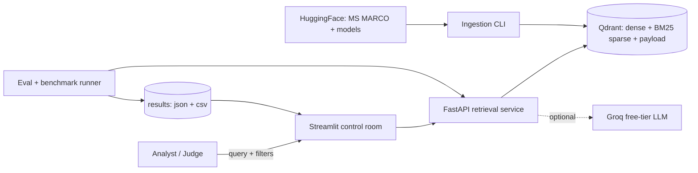
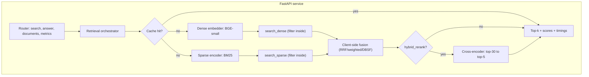
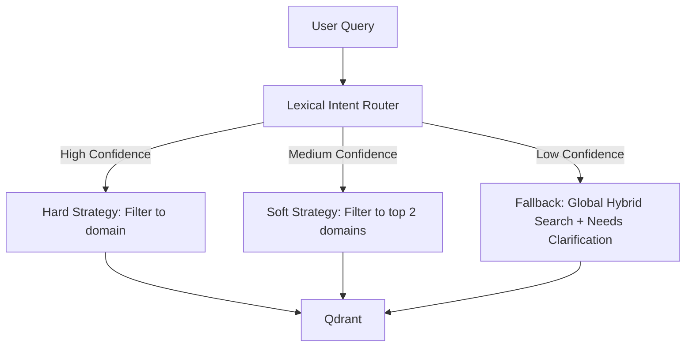

# Architecture — TrustRAG

## Design principles
1. **The API is the product.** UI, benchmark runner, eval harness and MCP clients are all clients of the same service.
2. **Ports and adapters.** `core/` defines interfaces and imports no vendor SDK; `adapters/` implements them. The store is swappable.
3. **One store, one truth.** Dense + BM25 sparse + payload on one Qdrant point.
4. **Config over constants.** Behaviour from `configs/*.yaml`, overridable per request, hashed into every result.
5. **Measure every stage.** Every response carries `timings_ms`.
6. **Fail soft.** Reranker, cache and LLM are optional; each degrades gracefully.
7. **Reproducible.** Pinned deps, seeded splits, resumable ingestion, snapshot restore.

## System context



## Query path (components)



## Repository layout

```
trustrag/
├── configs/            # retrieval.yaml, models.yaml, eval.yaml
├── src/trustrag/
│   ├── core/           # models, ports, fusion, ids, text, cache_key (no vendor SDK)
│   ├── adapters/       # qdrant_store, st_embedder, bm25_sparse, ce_reranker,
│   │                   #   groq_generator, memory_cache, in_memory_store
│   ├── ingestion/      # msmarco_loader, eval_set, enrich, pipeline, upload
│   ├── retrieval/      # orchestrator, filters, explain
│   ├── answering/      # answerer (evidence gate, citations, abstention)
│   ├── evaluation/     # metrics, ragas_runner, evaluator, benchmark, report
│   ├── api/            # FastAPI app + schemas
│   ├── ui/             # Streamlit control room
│   └── cli.py          # trustrag <command>
├── tests/              # unit tests (pure-logic modules)
├── data/eval/          # committed eval_queries.jsonl (seed 42)
├── results/            # committed result json/csv
└── docs/               # PRD, architecture, ADRs, BUSINESS_CASE, DEMO, STATUS
```

## Latency budget (planning estimates — measured in `results/`)

| Stage | Budget |
|---|---|
| Dense query encode (CPU) | ≤ 40 ms |
| BM25 query encode | ≤ 5 ms |
| Dense + sparse queries (2 × 50, filters inside) | ≤ 60 ms |
| Fusion (client-side) | ≤ 5 ms |
| API + serialisation (localhost) | ≤ 15 ms |
| **Hybrid total (target p95)** | **≤ 150 ms** |
| Cross-encoder rerank, 30 pairs (CPU) | ≤ 130 ms |
| **Hybrid + rerank total (target p95)** | **≤ 280 ms** (official limit 300 ms) |

## Decisions

All 12 architecture decisions are recorded in [`docs/adr/`](adr/).

## Banking Intent Router


